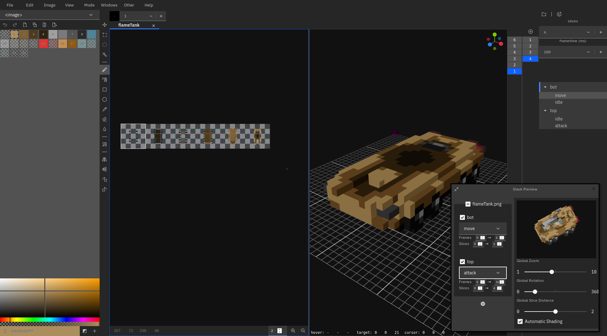

# Staxie

This is a WIP sprite/pixel editor designed to be used to create **sprite stacks**. Sprite stacks are simply 2D slices that make up a pseudo-3D object by rendering each 2D slice at a slight vertical offset, thereby creating the illusion of depth. This sprite stack can then be rotated, shaded per slice, and more.

At the moment, the stack interface is still being developed, however sprite editing via 2D and 3D views is functional along with sprite stack previewing.

There is a web-based version [here](https://kettek.github.io/staxie/). It is automatically updated whenever a new release is made. Keep in mind that it is not as thoroughly tested as the desktop applications.

## Technical Notes
This editor uses a PNG-based format via a custom stAx chunk that defines how the PNG data should be interpreted to represent data for sprite stacks. This allows the format to be readable by any program that can read PNGs. If the generated stAx file is more complex, then PNG chunk decoding can be used that adheres to the PNG Chunk Format section.

### PNG Chunk Format
All integer formats are expected to be in Big Endian. Only version '0' is expected and it is defined below.

#### Header

| name | type | description |
|-|-|-|
| version | uint8 | stAx version
| slice width | uint16 | Size of a slice in the X axis
| slice height | uint16 | Size of a slice in the Y axis
| stack count | uint16 | Count of stacks in the stax file
| stacks | array of Stack | The data of the Stacks, see below

#### Stack

| name | type | description |
|-|-|-|
| name length | uint8 | Length of the name of the stack
| name | variable | Name of the stack, derived from above
| slice count | uint16 | Count of slices in this stack
| animation count | uint16 | Count of animations for this stack
| animations | array of Animation | The data of the Animations, see below

#### Animation

| name | type | description |
|-|-|-|
| name length | uint8 | Length of the name of the animation
| name | variable | Name of the animation, derived from above
| frameTime | uint32 | How many frames the animation takes to play
| frameCount | uint16 | How many frames are in the animation
| frames | array of Frame | The data of the Frames, see below

#### Frame

| name | type | description |
|-|-|-|
| slices | array of Slice | The data of the Slices, see below

#### Slice

| name | type | description |
|-|-|-|
| shading | uint8 | The shading of the slice, from 0-255

## Live Development

To run in live development mode, run `wails dev` in the project directory. This will run a Vite development
server that will provide very fast hot reload of your frontend changes. If you want to develop in a browser
and have access to your Go methods, there is also a dev server that runs on http://localhost:34115. Connect
to this in your browser, and you can call your Go code from devtools.

## Building

To build a redistributable, production mode package, use `wails build`.
