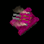

# Staxie
This is a sprite/pixel editor designed to be used to create **sprite stacks**. Sprite stacks are simply 2D layers that make up a pseudo-3D object by rendering each 2D layer at a slight vertical offset, thereby creating the illusion of depth. This sprite stack can then be rotated, shaded per layer, and more.

## Live Development

To run in live development mode, run `wails dev` in the project directory. This will run a Vite development
server that will provide very fast hot reload of your frontend changes. If you want to develop in a browser
and have access to your Go methods, there is also a dev server that runs on http://localhost:34115. Connect
to this in your browser, and you can call your Go code from devtools.

## Building

To build a redistributable, production mode package, use `wails build`.
